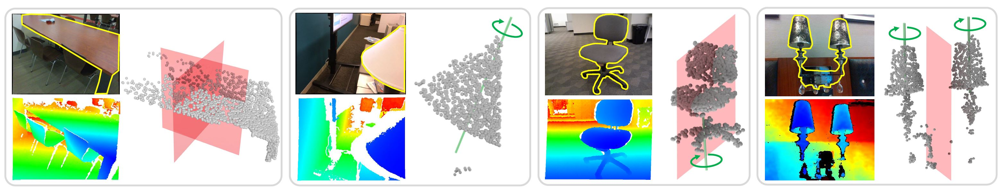

# SymmetryNet
SymmetryNet: Learning to Predict Reflectional and Rotational Symmetries of 3D Shapes from Single-View RGB-D Images

ACM Transactions on Graphics (Proceedings of SIGGRAPH Asia 2020)

Created by Yifei Shi, Junwen Huang, Hongjia Zhang, Xin Xu, Szymon Rusinkiewicz and Kai Xu



This repository includes:
* **tools**: the training scripts and evaluation scripts
  * **tools/train_shapenet.py**: the training script for shapenet dataset
  * **tools/train_ycb.py**: the training script for ycb dataset
  * **tools/train_scannet.py**: the training script for scannet dataset
  * **tools/evaluation**: the evaluation scripts
    * **evaluation/eval_ref_shapenet.py**: the evaluation script for reflectional symmetry on shapenet dataset
    * **evaluation/eval_ref_ycb.py**: the evaluation script for reflectional symmetry on ycb dataset
    * **evaluation/eval_ref_scannet.py**: the evaluation script for reflectional symmetry on scannet dataset
    * **evaluation/eval_rot_shapenet.py**: the evaluation script for rotational symmetry on shapenet dataset
    * **evaluation/eval_rot_ycb.py**: the evaluation script for rotational symmetry on ycb dataset
    * **evaluation/eval_rot_scannet.py**: the evaluation script for rotational symmetry on scannet dataset
* **lib**: the core Python library for networks and loss
  * **lib/loss.py**: symmetrynet loss caculation for both reflectional and rotational symmetries,the loss items are listed at the end of the text
  * **lib/network.py**: network architecture
  * **lib/tools.py**: functions for the operation of rotation and reflection
  * **lib/verification.py**: verification of the rotational and reflectional symmetries
* **datasets**: the dataloader and training/testing lists
  * **datasets/shapenet/dataset_config/*.txt**: training and testing splits for shapenet dataset, the testing splits includ holdout view/instance/category
  * **datasets/shapenet/dataset.py**: the training dataloader for shapnet dataset
  * **datasets/shapenet/dataset_eval.py**: the evaluation dataloader for shapnet dataset
  * **datasets/ycb/dataset_config/*.txt**: training and testing splits for shapenet dataset,the training/testing splits fallow the ycb defult settings
  * **datasets/ycb/dataset.py**: the training dataloader for ycb dataset
  * **datasets/ycb/dataset_eval.py**: the evaluation dataloader for ycb dataset
  * **datasets/scannet/dataset_config/*.txt**: training and testing splits for scannet dataset,the testing splits includ holdout view/scene
  * **datasets/shapenet/dataset.py**: the training dataloader for scannet dataset
  * **datasets/shapenet/dataset_eval.py**: the evaluation dataloader for scannet dataset
  
## Environments
pytorch>=0.4.1
python >=3.6

## Training
To train the network with the default parameter on shapenet dataset, run<br>
```
python tools/train_shapenet.py --dataset_root= your/folder/to/shapnet/dataset
```
To train the network with the default parameter on ycb dataset, run<br>
```
python tools/train_shapenet.py --dataset_root= your/folder/to/ycb/dataset
```
To train the network with the default parameter on scannet dataset, run<br>
```
python tools/train_shapenet.py --dataset_root= your/folder/to/scannet/dataset
```

## Evaluation
To evaluate the model with our metric on shapenet, for reflectional symmetry, run<br>

```
python tools/evaluation/eval_ref_shapenet.py
```

for rotational symmetry, run<br>

```
python tools/evaluation/eval_rot_shapenet.py
```

## Pretrained model & data download
The pretrained models and data can be found at [model](https://www.dropbox.com/sh/522ukzxe8nfmomv/AAArPKaoeccJOBv6z7ec1FH4a?dl=0) and [data](https://www.dropbox.com/sh/mt0ip97uotxl8p3/AADrh17UrqEfX1qALawhu7Sba?dl=0)

## Loss:
> center-loss + ref-ctp-loss + ref-foot-loss + rot-foot-loss + num-loss + mode-loss + ref-co-loss + rot-co-loss

* **ref-ctp-loss** : the counterpart error,i.e. ctp-dis/ctp-len
* **num-loss** : optmal assigment loss
* **mode-loss** : classification of symmetry types, ref-only(0)? rot-only(1)? both(2)?
* **ref-co-loss** : for reflectional symmetry, the distance from input point to its counterpart point is 2 times as large as the distance from input point to its foot point on the symmetry, i.e. ctp-dis = 2*foot-pt-dis
* **rot-co-loss**: for rotational symmetry, the vector from an input point to its foot point is perpendicular to the vector from center to the foot point,i.e. center-to-foot ⊥ pt-to-foot

